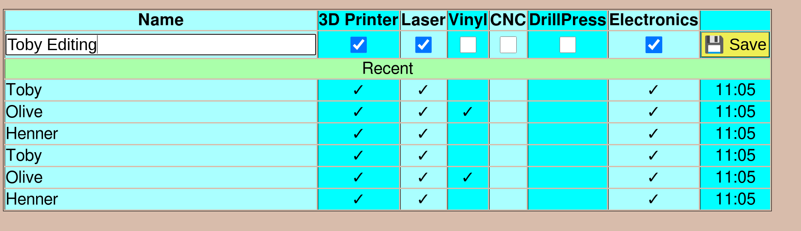

Makerspace Tag
==============

_Super quick and incomplete hack. Nothing to see here. Move along._

Tagging in and out makerspace users. Stores the timestamp and RFID card
serial in a log file.

In a second CSV file, RFID card serials associated with names and tool
permissions are stored.

```
Usage of makerspace_tag:
  -bind-address string
        Port to serve from (default "localhost:2000")
  -data string
        Directory where user-data and tag-log is stored. (default "/home/pi")
  -resources string
        Base directory for html-template and jingle wavs. (default "/home/pi")
 ```

### Files stored relative to `--data`

  * **Logging directory** `${data}/tag-log/`.
    Tag-in events stores _timestamp + RFID_. One file per day
    with names like `log-2021-09-19.csv`
    ```
    2021-09-22 23:49:05,28EA6F03000000000000
    2021-09-22 23:49:27,5E437003000000000000
    ```

  * **RFID to user name and permissions** `${data}/tag-users.csv`. Content
    Looks something like this
    ```
    5E437003000000000000,Henner,true,true,false,false,false,true
    750B7003000000000000,Toby,true,true,false,false,false,true
    ```

  * **Changelog** `${data}/changelog-user-updates.log` records changes when
    user name or permissions are changed

### Files expected relative to `--resources`

  * `${resources}/tagsounds/accept.wav`, `${resources}/tagsounds/attention.wav`
     Sounds to be played with an registered vs. unregistered tag.
  * `${resources}/template/tagin.html` HTML template


## User interface

The user interface is provided in the browser; by default `makerspace_tag`
listens on `http://localhost:2000/` (`--bind-address` flag) and consists of a
single page.

UI allows to edit last tagged user, including new users that
have been tagging in the first time and need a name associated with
the RFID. Each user has a set of tool permissions associated with it
that can easily be changed. Clicking on any of the form fields will show
the [&#x1F4BE; Save] button.



Below the latest users to tag in is a log of the last few people who tagged
in.

## Tag-In feedback

There is a sound played on each tag-in. Sound differs depending on if the
card is registered already or not.

To show an feedback light, uses https://github.com/hzeller/microorb which is
providing a http GET URL to change the color.

## Building

To compile we need golang and libnfc
```
sudo aptitude install golang libnfc-dev
```

nfc version needs to be at least 1.8.0
https://github.com/nfc-tools/libnfc/releases

```
make
```

should do it.

## Running
```
./makerspace-tag
```

## Running on startup

This can be done by making them services started by `systemd`.

### /etc/systemd/system/microorb.service
```ini
[Unit]
Description=Microorb
StartLimitIntervalSec=0

[Service]
Type=simple
Restart=always
RestartSec=1
User=pi
ExecStart=/usr/local/bin/microorb -P 9999

[Install]
WantedBy=multi-user.target
```


### /etc/systemd/system/makerspace_tag.service
```ini
[Unit]
Description=Makerspace Tag
StartLimitIntervalSec=0

[Service]
Type=simple
Restart=always
RestartSec=1
User=pi
ExecStart=/home/pi/bin/run-makerspace-tag.sh

[Install]
WantedBy=multi-user.target
```

With `run-makerspace-tag.sh`
```bash
#!/bin/bash
cd /home/pi/src/tag-in-out/
./makerspace_tag

```

To make things complete, run chromium in full screen, connecting to the URL
of the makertag.

Something like this `~/bin/kiosk.sh`

```bash
#!/bin/bash

# Don't have screen power management kick in.
xset s noblank
xset s off
xset -dpms

/usr/bin/chromium-browser --noerrdialogs --disable-infobars --kiosk http://localhost:2000/ &
```

Then, maybe put in some autostart, e.g.
`/etc/xdg/autostart/kiosk.desktop`
```ini
[Desktop Entry]
Exec=/home/pi/bin/kiosk.sh

```